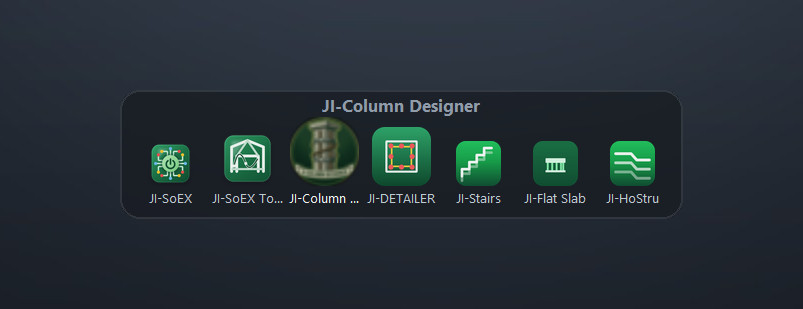

# JI-DETAILER


**JI-DETAILER** draws reinforced-concrete and structural-steel shop drawings
straight into a running AutoCAD session. You set the member parameters in a
narrow panel docked beside AutoCAD; it details the member, checks it, and
writes the finished sheet — sections, bar callouts, bending schedules, hook
tables and lap-splice tables — onto its own layer standard.

Detailed to **ACI 318-14**, **ACI 315-99** and **AISC 360-16**, as adopted by
**NSCP 2015**.

Members it details: pad, combined, strap and wall footings · columns ·
continuous beams · slab panels · stair flights · steel roof trusses · and the
framing plan the whole lot sits on.

---

## This repository

This is the **distribution hub**: the public place the installers live and the
place the app itself checks for a newer build. The application source is
proprietary and is **not** hosted here.

| What | Where |
|---|---|
| Installers | the [Releases](../../releases) tab — one release per version, tagged `vX.Y.Z` |
| Download page | <https://jonelphysique-tech.github.io/JI-DETAILER-Page/> |
| Checksums | `SHA256SUMS-<version>.txt`, attached to each release |
| JI-DOCKS | also released here, tagged `ji-docks-vX.Y.Z` — see [below](#also-here-ji-docks--free) |

Releases for JI-DETAILER are tagged `vX.Y.Z` and nothing else is. The bare
`v` prefix is what the app's update check matches on, so the free JI-DOCKS
releases carry a `ji-docks-` prefix and are invisible to it — a dock release
can never be mistaken for a JI-DETAILER version.

The app checks this repository's public release list once a day and shows a
notice in its footer when a newer version is published. Nothing is sent: it is
a plain GET, with no PC ID, no licence key and no customer name. A machine
that is offline, proxied or firewalled simply sees no notice.

## Installing

1. Open [Releases](../../releases) and pick the newest `vX.Y.Z`.
2. Download `JI-DETAILER-Setup-<version>.exe` from **Assets**.
3. Run it. It installs per-user, so it needs no administrator rights.
4. Launch JI-DETAILER. An unlicensed copy opens on an activation screen
   showing that PC's ID — press **Copy** and send it to your supplier.
5. Paste the licence you get back into the same screen and press **Activate**.
   The app starts immediately; there is no restart.

Upgrading is the same installer over the top. Your licence and settings live
under `%LOCALAPPDATA%\JI-DETAILER` and are deliberately left alone, so an
upgrade never asks you to re-license the same PC.

### Requirements

- Windows 10 or 11, 64-bit
- **AutoCAD 2018 or later** — JI-DETAILER drives it over ActiveX, and must run
  at the same privilege level as AutoCAD
- **Microsoft Edge WebView2 Runtime** — the setup checks for it and links to it
  if it is missing

### Verifying a download

Each release carries `SHA256SUMS-<version>.txt`. To check the installer you
downloaded is the one that was published:

```powershell
Get-FileHash .\JI-DETAILER-Setup-1.1.0.exe -Algorithm SHA256
```

## Licensing

JI-DETAILER uses offline, single-PC licences. A licence is a small signed file
bound to one PC identifier — there is no licence server and the app never
phones home. Licences are issued by JRB-iStruct against the PC ID shown on the
activation screen, and come with a PDF certificate recording the term, the
licence ID and the registered PC.

If a PC ID changes — a replaced motherboard or disk, or a Windows reinstall —
ask for a replacement licence against the new ID.

---

## Also here: JI-DOCKS — free



**JI-DOCKS** is a floating dock for Windows: a bar that sits above the desktop
and launches your programs with one click. It is **free**, with no licence, no
account and no PC ID, and it is not tied to JI-DETAILER in any way.

It starts **empty**. You fill it by dragging program icons onto it, so it holds
exactly what you put there.

| To do this | Do that |
|---|---|
| Add an app | Drag its icon onto the dock — a shortcut, an `.exe`, a Start-menu item, a folder or a document |
| Add several at once | Drag a multiple selection, or right-click → **Add app…** |
| Fill it in one click | Right-click → **Add all JRB-iStruct apps** |
| Reorder tiles | Drag a tile sideways |
| Remove a tile | Drag it away from the dock, or right-click it → **Remove from dock** |
| Move the dock | Drag any empty part of it |

Removing a tile only takes it off the dock. It never deletes the program.

Icons come out of each program itself, so the tiles look the way the apps do in
Explorer. The panel is frosted over your wallpaper, icons magnify under the
pointer, and a ring spins on a tile from the moment you click until that app
actually has a window open.

### Installing JI-DOCKS

1. Open [Releases](../../releases) and find **JI-DOCKS 1.0.0**
   (tag `ji-docks-v1.0.0`).
2. Download `JI-DOCKS-Setup-1.0.0.exe` from **Assets**.
3. Run it. It installs per-user, so it needs no administrator rights.

Let the setup tick **Start JI-DOCKS when Windows starts** and the dock comes
back on its own after a restart, once the desktop has finished loading. You can
change that later from the dock's own right-click menu.

Requirements: Windows 10 or 11, 64-bit. Nothing else — no runtime to install.
It needs neither AutoCAD nor WebView2.

Your tiles and settings live in `%LOCALAPPDATA%\JI-DOCKS`, and the installer
leaves that folder alone, so upgrading never costs you your dock.

### JI-DOCKS licence

JI-DOCKS is released under the **MIT licence** — free to use, copy and pass on.
This is deliberately different from JI-DETAILER above, which is proprietary and
licensed per PC.

## License and legal

**Copyright (c) 2026 JRB-iStruct. All rights reserved.**

This repository is public for software distribution and web hosting only. You
may not reverse-engineer, decompile, or attempt to bypass the licensing of the
downloadable executable, and you may not copy, modify or redistribute the
hosted page or its assets without written permission.

This paragraph covers **JI-DETAILER**. **JI-DOCKS**, described above, is a
separate product released under the MIT licence and may be freely copied and
redistributed.

Using JI-DETAILER means accepting the End User License Agreement included with
the installer.

AutoCAD is a registered trademark of Autodesk, Inc. JI-DETAILER is an
independent product and is not affiliated with, authorised by, or endorsed by
Autodesk.

Output is a drafting aid. The engineer of record remains responsible for
verifying every detail against the governing code and project documents.
